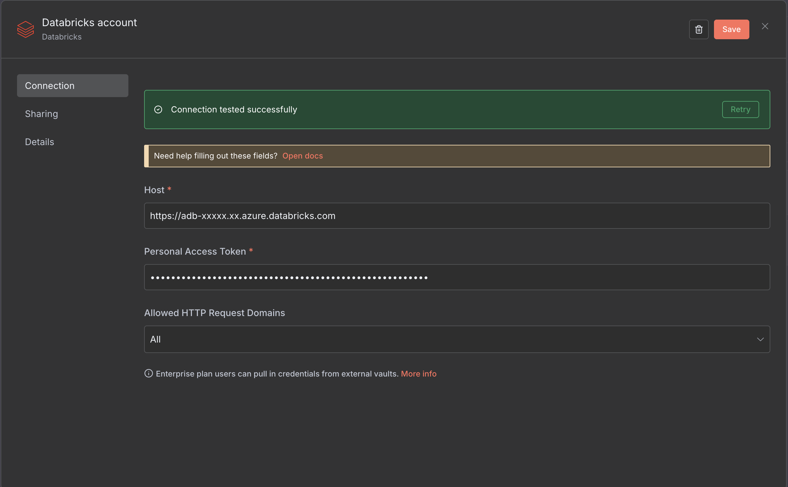
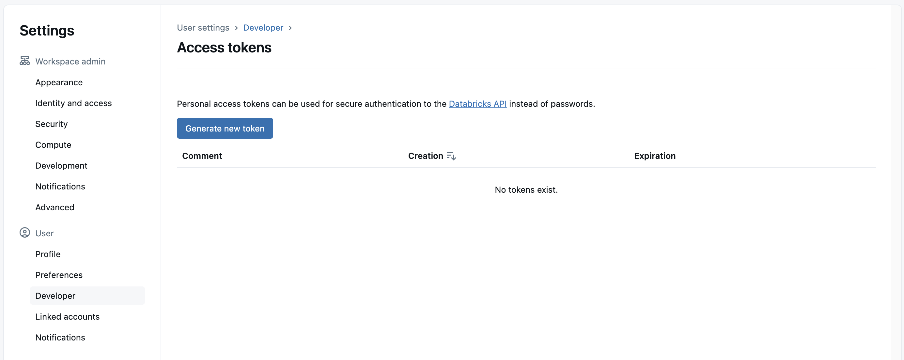
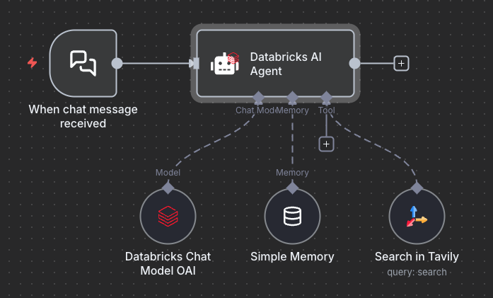
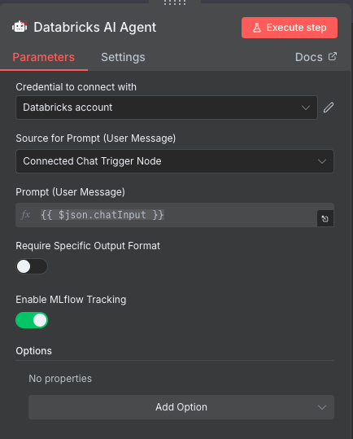

# n8n-nodes-databricks

This is an n8n community node that provides comprehensive integration with Databricks APIs, including Genie AI, SQL, Unity Catalog, Model Serving, Files, and Vector Search capabilities.


## Features

- 🤖 **Genie AI Assistant**: Start conversations, send messages, and execute SQL queries through Databricks' AI assistant
- 🤖 **AI Agent with MLflow Tracking**: Full-featured AI agent with optional MLflow observability for comprehensive tracing
- 📂 **File Operations**: Upload, download, list, and manage files in Databricks volumes (up to 5 GiB)
- 🗄️ **Databricks SQL**: Execute SQL queries and manage statements
- 📚 **Unity Catalog**: Manage catalogs, schemas, tables, and volumes
- 🤖 **Model Serving**: Query AI models and manage endpoints
- 🔍 **Vector Search**: Perform vector similarity searches

## Prerequisites

You need the following installed on your development machine:

* [git](https://git-scm.com/downloads)
* Node.js and pnpm. Minimum version Node 18. You can find instructions on how to install both using nvm (Node Version Manager) for Linux, Mac, and WSL [here](https://github.com/nvm-sh/nvm). For Windows users, refer to Microsoft's guide to [Install NodeJS on Windows](https://docs.microsoft.com/en-us/windows/dev-environment/javascript/nodejs-on-windows).
* Install n8n with:
  ```
  pnpm install n8n -g
  ```
* A Databricks workspace with a personal access token

## Installation

### For Development

1. Clone this repository:
   ```bash
   git clone https://github.com/<your-org>/n8n-nodes-databricks.git
   cd n8n-nodes-databricks
   ```

2. Install dependencies:
   ```bash
   pnpm install
   ```

3. Build the node:
   ```bash
   pnpm build
   ```

4. Link to your n8n installation:
   ```bash
   npm link
   cd ~/.n8n/custom
   npm link n8n-nodes-databricks
   ```

### From npm (Coming Soon)

```bash
npm install n8n-nodes-databricks
```

## Credentials



To use this node, you need to configure Databricks credentials:

1. **Host**: Your Databricks workspace URL (e.g., `https://adb-1234567890123456.7.azuredatabricks.net`)
2. **Token**: Your Databricks personal access token

To generate a token:



1. Log into your Databricks workspace
2. Go to User Settings → Access Tokens
3. Click "Generate New Token"
4. Copy and save the token securely

## Architecture

### 📊 Project Structure

```
n8n-nodes-databricks/
│
├── 🎯 Main Node Entry Point
│   └── nodes/Databricks/Databricks.node.ts
│       ├── Class: Databricks (implements INodeType)
│       ├── Properties:
│       │   ├── displayName: 'Databricks'
│       │   ├── version: 1
│       │   ├── usableAsTool: true (can be used as an AI agent tool)
│       │   └── requestDefaults: { baseURL, Authorization }
│       │
│       ├── Node Configuration:
│       │   ├── Resource selector (dropdown):
│       │   │   ├── Genie (AI Assistant)
│       │   │   ├── Databricks SQL
│       │   │   ├── Unity Catalog
│       │   │   ├── Model Serving
│       │   │   ├── Files
│       │   │   └── Vector Search
│       │   │
│       │   ├── Operations (per resource)
│       │   └── Parameters (per resource)
│       │
│       └── Execute Method:
│           ├── Process each input item
│           ├── Handle special cases (custom logic)
│           └── Error handling with continueOnFail support
│
├── 📁 Resource Definitions
│   └── nodes/Databricks/resources/
│       ├── index.ts (exports all operations & parameters)
│       │
│       ├── 🤖 genie/
│       │   ├── operations.ts
│       │   │   └── Operations: [6 operations]
│       │   │       ├── startConversation
│       │   │       ├── createMessage
│       │   │       ├── getMessage
│       │   │       ├── executeMessageQuery
│       │   │       ├── getQueryResults
│       │   │       └── getSpace
│       │   │
│       │   └── parameters.ts
│       │       └── Parameters: spaceId, conversationId, messageId, etc.
│       │
│       ├── 📂 files/
│       │   ├── operations.ts
│       │   │   └── Operations: [7 operations]
│       │   │       ├── uploadFile (PUT binary data)
│       │   │       ├── downloadFile (GET file content)
│       │   │       ├── deleteFile (DELETE)
│       │   │       ├── getFileInfo (HEAD metadata)
│       │   │       ├── listDirectory (GET directory contents)
│       │   │       ├── createDirectory (PUT)
│       │   │       └── deleteDirectory (DELETE)
│       │   │
│       │   └── parameters.ts
│       │
│       ├── 🗄️ databricksSql/
│       ├── 📚 unityCatalog/
│       ├── 🤖 modelServing/
│       └── 🔍 vectorSearch/
│
├── 🤖 AI Agent Node
│   └── nodes/agents/DatabricksAiAgent/
│       ├── DatabricksAiAgent.node.ts (node definition)
│       ├── execute.ts (agent execution with MLflow)
│       ├── CallbackHandler.ts (MLflow tracing)
│       ├── description.ts (node properties)
│       ├── utils.ts (input configuration)
│       └── src/
│           ├── constants.ts (MLflow constants)
│           ├── types/ (TypeScript types)
│           └── utils/ (helper functions)
│
├── 🔐 Credentials
│   └── credentials/Databricks.credentials.ts
│       └── DatabricksCredentials interface:
│           ├── host: string (Databricks workspace URL)
│           └── token: string (Personal access token)
│
└── 🎨 Assets
    ├── databricks.svg (light mode icon)
    └── databricks.dark.svg (dark mode icon)
```

### 🔄 Execution Flow

```
User Input (n8n workflow)
    ↓
1. User selects RESOURCE (e.g., "Genie")
    ↓
2. User selects OPERATION (e.g., "Start Conversation")
    ↓
3. UI displays relevant PARAMETERS (using displayOptions.show)
    ↓
4. User fills in parameters (spaceId, initialMessage, etc.)
    ↓
5. Execute method is called
    ↓
6. Two execution paths:
    │
    ├─→ Path A: Declarative Routing (most operations)
    │   ├── n8n uses 'routing' config from operations.ts
    │   ├── Automatically builds HTTP request
    │   ├── Substitutes parameters using {{$parameter.xxx}}
    │   └── Sends request with credentials from requestDefaults
    │
    └─→ Path B: Custom Logic (special cases)
        ├── Files.uploadFile → Custom binary data handling
        └── Genie operations → Custom switch statement
            ├── Build URL dynamically
            ├── Create request body
            ├── Call this.helpers.httpRequest()
            └── Return response
    ↓
7. Return INodeExecutionData[][]
```

### 🧩 Key Architectural Patterns

#### 1. Resource-Based Organization
Each Databricks API category is a separate "resource" with its own operations and parameters.

#### 2. Declarative Routing
Most operations use n8n's declarative `routing` configuration:
```typescript
routing: {
  request: {
    method: 'POST',
    url: '=/api/2.0/genie/spaces/{{$parameter.spaceId}}/conversations',
    body: {
      initial_message: '={{$parameter.initialMessage}}'
    }
  }
}
```

#### 3. Conditional Parameter Display
Parameters appear/hide based on selected resource and operation:
```typescript
displayOptions: {
  show: {
    resource: ['genie'],
    operation: ['startConversation']
  }
}
```

#### 4. Two Execution Modes
- **Declarative**: n8n handles HTTP requests automatically (most operations)
- **Imperative**: Custom logic in execute() method (files upload, genie operations)

#### 5. Error Handling
Comprehensive error handling with three types:
- **API Errors**: Status code + error details
- **Network Errors**: Connection failures
- **Other Errors**: General exceptions

All support `continueOnFail` mode for resilient workflows.

### 🤖 AI Agent Execution Flow

```
User Input → Databricks AI Agent Node
    ↓
1. Load Configuration
    ├─ Get Chat Model (required)
    ├─ Get Tools (optional)
    ├─ Get Memory (optional)
    ├─ Get Output Parser (optional)
    └─ Check MLflow enabled
    ↓
2. MLflow Setup (if enabled)
    ├─ Validate Databricks credentials
    ├─ Get/Create experiment: /Shared/n8n-workflows-{workflow-id}
    └─ Initialize MLflow CallbackHandler
    ↓
3. Agent Execution
    ├─ Create LangChain ToolCallingAgent
    ├─ Setup fallback model (if configured)
    └─ Execute with streaming or standard mode
    ↓
4. Processing Loop (for each iteration)
    ├─ LLM Call → MLflow CHAT_MODEL span
    ├─ Tool Calls → MLflow TOOL spans
    └─ Continue until final answer
    ↓
5. MLflow Tracing (if enabled)
    ├─ Log AGENT span with full execution
    ├─ Record token usage and latency
    └─ Capture all intermediate steps
    ↓
6. Return Result
    └─ Output text/structured data to n8n workflow
```

## Development

### Building the Node

```bash
pnpm build
```

### Linting

```bash
pnpm lint
# or auto-fix
pnpm lintfix
```

### Testing

```bash
pnpm test
```

## Databricks AI Agent



The **Databricks AI Agent** node provides a full-featured AI agent built on LangChain's ToolCallingAgent with optional **MLflow observability** for comprehensive tracing of your agent's reasoning, tool usage, and LLM interactions.

### Key Features

#### AI Agent Capabilities
- **Tool Calling** - Supports any LangChain tool or MCP toolkit
- **Memory** - Conversation history with BaseChatMemory
- **Structured Output** - Optional output parser for validated JSON responses
- **Streaming** - Real-time token streaming support
- **Fallback Models** - Automatic failover to secondary model
- **Binary Images** - Automatic passthrough of images to vision models

#### MLflow Observability (Optional)
- **Toggle On/Off** - Enable MLflow logging with a simple checkbox
- **Automatic Tracing** - Creates MLflow spans for every step when enabled
- **Span Types**:
  - `AGENT` - Overall agent execution
  - `CHAT_MODEL` - LLM calls with token usage
  - `TOOL` - Tool invocations with arguments and results
  - `RETRIEVER` - Vector store retrievals (if used)
- **Metrics** - Latency, token counts, model info
- **Tags & Metadata** - Full context for filtering and analysis

### Configuration

#### Enabling MLflow (Optional)

MLflow logging is **disabled by default**. To enable it:

1. Add the **Databricks AI Agent** node to your workflow
2. Toggle **"Enable MLflow Tracking"** to ON
3. Configure Databricks credentials (credential selector appears when enabled)
4. The node will **automatically** use your workflow ID as the experiment name

#### MLflow Experiment Management (Automatic)

When MLflow tracking is enabled, the node **automatically manages experiments**:

- **Experiment Name**: Automatically set to `/Shared/n8n-workflows-{workflow-id}`
- **Auto-Creation**: If the experiment doesn't exist, it's created automatically
- **Auto-Reuse**: If the experiment exists, it's reused automatically
- **One Workflow = One Experiment**: Each n8n workflow gets its own dedicated MLflow experiment
- **Shared Workspace**: Experiments are created in `/Shared/` for team accessibility

### Usage

#### Basic Agent Setup



1. **Add Agent Node** - Drag "Databricks AI Agent" to your workflow
2. **Connect Chat Model** - Add OpenAI, Databricks, or compatible model
3. **Connect Tools** (optional) - Add n8n tools or MCP clients
4. **Connect Memory** (optional) - Add chat memory for conversations
5. **Configure Input** - Map user message to the agent

#### Node Inputs

The node requires these **connections**:

- **Chat Model** (required) - The LLM to use
- **Tools** (optional) - Zero or more tools the agent can call
- **Memory** (optional) - For conversation history
- **Output Parser** (optional) - For structured JSON validation

### MLflow Traces


Every agent execution creates a trace in Databricks MLflow with:

- **Agent Span** - Overall execution with messages and system prompt
- **Chat Model Spans** - Each LLM call with:
  - Input messages
  - Model parameters (temperature, max_tokens, etc.)
  - Response with token usage
  - Latency metrics
- **Tool Spans** - Each tool invocation with:
  - Tool name and description
  - Input arguments
  - Output results
  - Execution time

**Metrics captured per trace:**
- Total latency
- Total cost
- Total tokens (input + output)
- LLM calls count
- Tool calls count

## Usage Examples

### Example 1: AI Agent with MLflow Tracking

1. Add the **Databricks AI Agent** node to your workflow
2. Connect a **Chat Model** node (e.g., OpenAI or Databricks Chat Model)
3. (Optional) Connect **Tools** - Add any n8n tools you want the agent to use
4. (Optional) Connect **Memory** - Add chat memory for conversation history
5. Toggle **"Enable MLflow Tracking"** to ON
6. Select your **Databricks credentials**
7. Configure the input prompt
8. Run the workflow - traces will appear in MLflow under `/Shared/n8n-workflows-{workflow-id}`

### Example 2: Start a Genie Conversation

1. Add the Databricks node to your workflow
2. Select Resource: **Genie**
3. Select Operation: **Start Conversation**
4. Enter your **Space ID**
5. Enter your **Initial Message**: "Show me sales data for last quarter"

### Example 3: Upload a File to Databricks Volume

1. Add the Databricks node after a node that provides binary data
2. Select Resource: **Files**
3. Select Operation: **Upload File**
4. Configure:
   - Data Field Name: `data`
   - Catalog: `main`
   - Schema: `default`
   - Volume: `my_volume`
   - Path: `reports/report.pdf`

### Example 4: Query Vector Search

1. Add the Databricks node to your workflow
2. Select Resource: **Vector Search**
3. Select Operation: **Query Index**
4. Configure your query parameters

## Adding New Operations

To extend this node with new operations:

1. Navigate to the appropriate resource folder in `nodes/Databricks/resources/`
2. Add the new operation to `operations.ts`:
   ```typescript
   {
     name: 'My New Operation',
     value: 'myNewOperation',
     description: 'Description of what it does',
     action: 'Perform my new operation',
     routing: {
       request: {
         method: 'GET',
         url: '=/api/2.0/path/{{$parameter.id}}'
       }
     }
   }
   ```
3. Add required parameters to `parameters.ts`
4. Rebuild and test

## Contributing

Contributions are welcome! Please feel free to submit a Pull Request.

## Support

For issues, questions, or contributions, please visit the [GitHub repository](https://github.com/<your-org>/n8n-nodes-databricks).

## Resources

- [n8n Documentation](https://docs.n8n.io/)
- [Databricks API Documentation](https://docs.databricks.com/api/)
- [n8n Community](https://community.n8n.io/)

## License

[MIT](LICENSE.md)
